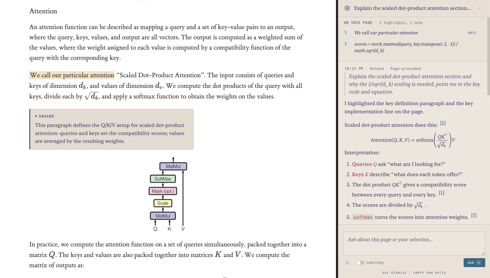

# Stoody Book

Stoody Book is the backend-hosted learning workspace used from the Stoody Mentor tab. It is served by the main backend at `/stoody-book` and replaces the old Mentor ChatBot frontend entry point.

The original Onhand browser-extension source is preserved under `packages/browser-extension/` as legacy source material while Stoody Book is absorbed into the backend repo.

## Backend surface

- `web/` - backend-served Stoody Book app
- `web/assets/` - browser-neutral CSS and JavaScript for the backend app
- `packages/browser-extension/` - preserved legacy extension runtime source
- `docs/` - preserved legacy architecture, QA, and planning notes

<p align="center">
  
</p>

<p align="center"><em>Onhand grounding an explanation in the page the user already has open.</em></p>

The preserved legacy extension intended experience was:
- invoke Onhand from the browser extension side panel
- ask a question about the page, PDF, file, or material already in front of you
- have Onhand point to the relevant place, scroll to it, highlight it, and explain it in context
- save the session so it can be replayed later with the relevant artifacts restored

## Current status

Onhand now uses the browser extension as its runtime:

1. the Chromium extension hosts the side panel UI
2. `@mariozechner/pi-agent-core` and `@mariozechner/pi-ai` are bundled into the extension
3. sidebar messages route to an in-extension runtime controller
4. browser tools call the existing extension command handlers directly
5. Onhand Free, OpenAI Codex sign-in, and provider API-key auth are configured from the extension options page
6. runtime settings are stored in `chrome.storage.local`; sessions and artifacts are stored as per-record entries in extension IndexedDB

## Browser-only direction

The browser extension is the whole Onhand runtime. The Electron desktop app, localhost bridge, and pi-extension bridge adapter have been removed.

See:

- `docs/BROWSER_ONLY_MIGRATION.md`

The broader product plan lives in:

- `docs/ONHAND_CONSTITUTION.md`
- `docs/ONHAND_PLAN.md`
- `docs/VOICE_ARCHITECTURE.md`

## Current repository layout

- `docs/ONHAND_PLAN.md` - product and implementation plan
- `packages/browser-extension/` - unpacked Chromium extension and browser-hosted Pi runtime
- `scripts/` - browser-runtime build, smoke, fixture, preflight, and Chrome acceptance helpers
- `website/` - static landing site, privacy policy, support page, and Chrome Web Store links

## Security and privacy model

- Browser-only mode stores runtime settings in extension storage, including the selected auth mode, model, optional provider API keys, OpenAI Codex sign-in credentials, and the anonymous Onhand Free token.
- Onhand Free uses a hosted Cloudflare Worker that forwards model requests to OpenRouter with daily usage caps. Anonymous diagnostics are required for Onhand Free so the hosted endpoint can monitor reliability, cost, quota pressure, crashes, and abuse.
- OpenAI Codex sign-in uses the browser OAuth flow with selectable Codex text models. `gpt-5.5` is the default and recommended model for Onhand's page-grounded tool use.
- Provider API-key mode calls the selected provider directly from the extension runtime. Supported providers include OpenAI, Anthropic, Google Gemini, and OpenRouter.
- Anonymous diagnostics and explicit error reports are redacted. They do not include prompts, page content, URLs, screenshots, saved sessions, transcripts, or keys. Sentry receives only redacted crash/exception events when diagnostics are enabled or when the user explicitly sends an anonymized error report.
- `browser_run_js` is an optional, constrained last-resort runtime-state inspection tool for complex client-side pages. Users can disable it from the options page.

Related docs:

- `website/privacy.html`
- `docs/FREE_TIER.md`
- `docs/SENTRY.md`
- `docs/STORE_LISTING.md`

## Setup

### 1. Install dependencies

```bash
npm install
```

### 2. Build the extension runtime bundle

```bash
npm run build:extension
```

### 3. Load the browser extension

- Open your Chromium-based browser's extensions page
- Enable developer mode
- Load unpacked extension from `packages/browser-extension/`
- Open the extension options page
- Easiest: select `Onhand Free (beta)` for no-key, no-account usage with a daily cap.
- Preferred for regular text chat: use OpenAI Codex sign-in:
  - click `Sign in` in the OpenAI Codex Sign-In section
  - finish the opened OpenAI login tab
  - confirm Authentication is set to `OpenAI Codex sign-in`
  - keep the default/recommended model, `gpt-5.5`, unless you are intentionally testing another selectable Codex model
- For your own provider key:
  - set Authentication to `Provider API key`
  - choose OpenAI, Anthropic, Google Gemini, or OpenRouter
  - enter the provider API key
  - choose a model if needed
  - Save
- Voice mode requires an OpenAI platform API key with Realtime API access. You can paste this key in the options page while keeping Authentication set to OpenAI Codex sign-in for text chat.

If Helium supports Chromium extensions and the `chrome.debugger` API, the same unpacked extension should work there too.

## Testing The Browser Runtime

```bash
npm run build:extension
npm run smoke:browser-runtime
```

For a real provider call:

```bash
OPENAI_API_KEY=... npm run smoke:browser-runtime -- --real-openai
```

For a manual Chrome smoke, reload the unpacked extension, sign in with OpenAI Codex, confirm the options page shows `authMode: "oauth"`, `aiProvider: "openai-codex"`, the recommended `aiModel: "gpt-5.5"`, `hasOAuthCredentials: true`, and `expired: false` in the status JSON, then run the local fixture with `npm run serve:fixture`. Open `http://127.0.0.1:8765/` in Chrome, start a fresh Onhand side-panel session with a Chrome-specific title, and submit the read, interaction, debug, artifact, and network reload prompts there.

For browser-runtime regression coverage, run:

```sh
npm run build:browser-runtime
npm run test:browser-runtime-regressions
npm run smoke:browser-runtime -- --ports
```

For the repeatable Chrome/OAuth acceptance gate, see `docs/CHROME_ACCEPTANCE.md` or print the current prompt matrix with:

```sh
npm run acceptance:chrome -- --suite=all
```

## Experimental Realtime Voice Tutor

This branch includes an experimental `gpt-realtime-2` WebRTC voice tutor for the side panel. Start the local session endpoint with:

```sh
OPENAI_API_KEY=... npm run serve:realtime
```

Voice requires an OpenAI platform API key saved in the Onhand options page. Open the options page, paste a platform key with Realtime API access in the OpenAI platform API key field, save, reload the extension, and click `Voice` in the side panel. You can keep Authentication set to OpenAI Codex sign-in for text chat. The local endpoint is only a fallback/dev path. Details are in `docs/REALTIME_VOICE.md`.

## Browser Runtime Tools

- `browser_list_tabs`
- `browser_activate_tab`
- `browser_navigate`
- `browser_open_pdf_in_onhand_viewer`
- `browser_extract_content`
- `browser_highlight_text`
- `browser_show_note`
- `browser_scroll_to_annotation`
- `browser_clear_annotations`
- `browser_get_visible_text`
- `browser_get_visible_region_image`
- `browser_get_selection`
- `browser_get_viewport_headings`
- `browser_get_scroll_state`
- `browser_capture_state`
- `browser_list_artifacts`
- `browser_restore_state`
- `browser_find_elements`
- `browser_wait_for_selector`
- `browser_click`
- `browser_type`
- `browser_click_text`
- `browser_type_by_label`
- `browser_pick_elements`
- `browser_collect_console`
- `browser_collect_network`
- `browser_get_dom`
- `browser_capture_screenshot`
- `browser_run_js` (optional last-resort runtime-state inspection for complex client-side pages)

## Notes

- If you previously loaded the unpacked extension from the old top-level `browser-extension/` path, reload it from `packages/browser-extension/`.
- `chrome.debugger` is a powerful permission and may show a browser warning while attached.
- Some pages cannot be debugged, such as privileged browser pages.
- Session restore/review is now artifact-backed for annotated turns. The side panel's Review action can preview saved snapshots/transcripts, and annotated replies automatically save an HTML/screenshot snapshot when the model did not explicitly capture one. Restore fidelity for changed pages and missing tabs is still in progress.

## License

Onhand is licensed under the Apache License, Version 2.0. See `LICENSE` for details.

## Likely next steps

- stronger replay/restore fidelity for changed pages and missing tabs beyond best-effort text matching
- session/artifact export-import and a storage-usage readout now that sessions/artifacts live in IndexedDB
- tighter release/ops automation for Chrome Web Store submissions, website version sync, free-tier monitoring, and Sentry checks
